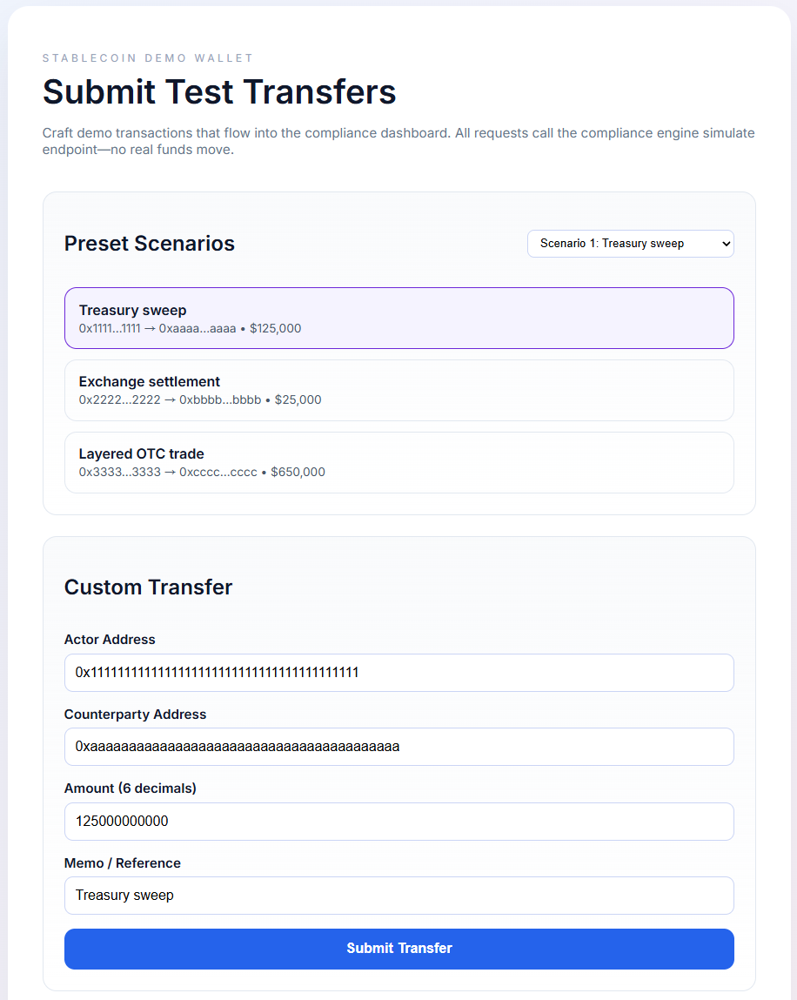
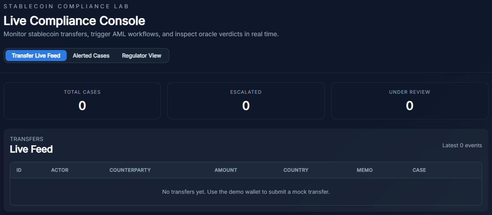
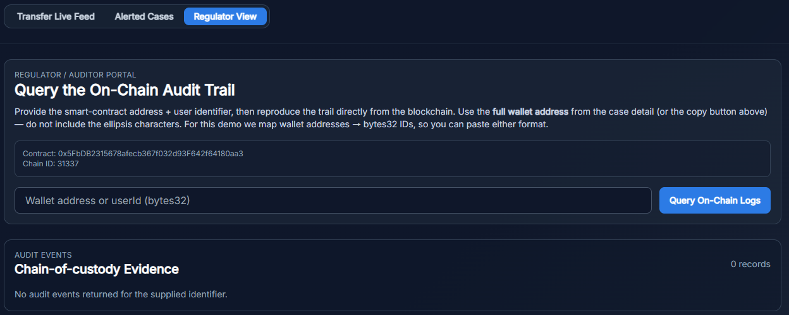

# Smart Contract: CexAmlAuditTrail

This directory contains the Solidity smart contracts for the Stablecoin Compliance Demo. The main contract, `CexAmlAuditTrail`, serves as an immutable, append-only ledger for recording AML (Anti-Money Laundering) decisions and audit trails.

### Prerequisites

- Node.js (v18 or v20 recommended)
- npm or pnpm

### Installation

Navigate to the `contracts` directory and install dependencies:

```bash
cd contracts
npm install
```

### Compilation

Compile the Solidity contracts to generate artifacts and type definitions:

```bash
npm run compile
```

This command uses Hardhat to compile `contracts/StablecoinMonitor.sol` and outputs artifacts to the `artifacts/` directory and TypeScript bindings to `typechain-types/`.

### Testing

Run the test suite to verify contract functionality:

```bash
npm run test
```

The tests (located in `test/StablecoinMonitor.ts`) cover:
- **Deployment**: Verifying the contract initializes correctly.
- **Access Control**: Ensuring only the authorized backend can log events.
- **Event Emission**: Validating that `SuspiciousActivity`, `DepositTrace`, and `AmlResolution` events are emitted with correct parameters (including the "Release" action).

# Stablecoin Compliance & Analytics Demo

End-to-end prototype that links a Solidity compliance monitor with oracle mocks, an off-chain AML engine, a compliance dashboard, and a demo wallet for generating test transfers.

### Repository Layout
- `contracts/` – Hardhat project containing the `CexAmlAuditTrail` audit-log contract.
- `services/oracle-mock/` – Mock Civic/Refinitiv/Oraculos endpoints.
- `services/compliance-engine/` – Event listener + AML rules engine + REST/SSE API.
- `dashboard/` – Analyst-facing React app for reviewing cases.
- `wallet/` – Demo wallet React app that injects transfers via the compliance engine’s simulate endpoint.
- `docs/` – Architecture notes, runbooks, and scenario guides.

### Prerequisites
- Node.js 18+
- PNPM or npm 8+ (workspaces enabled)
- This setup is cross-platform and works on macOS, Linux, and Windows.

### Quick Start
```bash
npm install
npm run dev
```

*Note: If using PNPM instead of npm, replace `npm` with `pnpm` in the commands above.*

The `dev` script:
1. Starts a Hardhat node on `127.0.0.1:8545`.
2. Deploys `CexAmlAuditTrail` (a simple append-only AML audit log) and records the address in `deployments/local.json`.
3. Launches the oracle mock (4001), compliance engine (4002), compliance dashboard (5173), and demo wallet (5174).

Once the stack is live:
## Demo wallet: 
- `http://localhost:5174` – submit preset or custom transfers (hit `/transfers/simulate`).


## Compliance dashboard: 
- `http://localhost:5173` – monitor transfers, trigger AML checks, and inspect oracle verdicts. Use the role toggle (Analyst / Policy Admin / Auditor) to mirror the contract’s three lines of defense.

### Tabs
- **Transfer Live Feed** – real-time stream of simulated and wallet-generated transfers, including verdict badges once the AML engine finishes its review.


- **Alerted Cases** – queue of escalated cases with oracle context, STR switch, and the “Push Evidence On-Chain” workflow (Freeze, Due Diligence, or Release) that emits `logSuspicious` / `logDepositTrace` / `logResolution` events.


- **Regulator View** – on-chain replay portal where auditors can paste the copied userId/wallet to fetch audit trail events directly from the `CexAmlAuditTrail` contract.


By default the compliance engine starts empty; set `SEED_DEMO=true` before running if you want the three narrated demo cases pre-loaded (see `docs/demo-scenarios.md`). `docs/runbook.md` contains a walkthrough.
